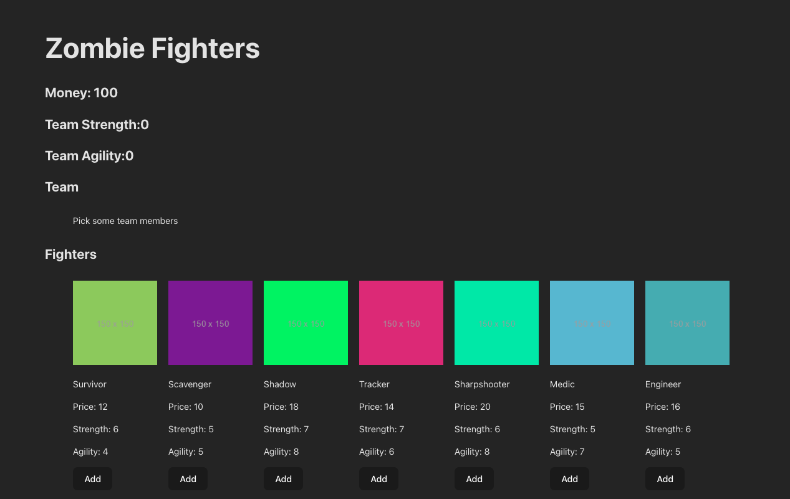

# 

## About
Reactville is on high alert! As bizarre rumors turn into chilling reality, the city council has called for immediate action to safeguard the town and its inhabitants - against a looming zombie apocalypse! 

Your mission is to strategically assemble a survival team, handpicking members from the city's diverse population, each bringing their unique skills and quirks. As the city's newly appointed Survival Strategist, you will manage your team's skills, resources, and stats.



In this lab, you'll utilize React's state management to add and remove team members, track essential resources, and monitor your team's overall readiness. This isn't just about surviving; it's about making dynamic UI updates and understanding the inner workings of React state through a fun and engaging simulation.

## Prerequisites
- React State Management
- TypeScript fundamentals


## Setup

Clone this repo and then 

Create a new Vite project for your React app:

```bash
npm create vite@latest state-management-lab -- --template react-ts
```

navigate to the new project directory and install the necessary dependencies:

```bash
cd react-state-management-lab
npm i
```

but since we're using Docker, go back to where the Dockerfile is `cd ..` then  we can use our `docker-compose up --build` command to start and stop our server

Open the project's folder in your code editor:

```bash
code .
```

### Clear `App.tsx`

Open the `App.tsx` file in the `src` directory and replace the contents of it with the following:

```tsx
// src/App.tsx

const App: React.FC = () => {

  return (
    <h1>Hello world!</h1>
  );
}

export default App
```


### Running the development server

To start the development server and view our app in the browser, we'll use the following command: 

```bash
npm run dev
```

You should see that `Vite` is available on port number 5173: 

```plaintext
localhost:5173
```

### GitHub setup

To add this project to GitHub, initialize a Git repository:

```bash
git init
git add .
git commit -m "init commit"
```

Make a new repository on [GitHub](https://github.com/) named react-state-management-lab. 

Link your local project to your remote GitHub repo:

```bash
git remote add origin https://github.com/<github-username>/react-state-management-lab.git
git push origin main
```

> 🚨 Do not copy the above command. It will not work. Your GitHub username will replace `<github-username>` (including the `<` and `>`) in the URL above.


Welcome to the React State Management Lab! In this lab, we'll be interacting with state to get a better understanding of how to manage it in a React application. Your task is to assemble a team of characters to survive a zombie apocalypse. You will:

- Add characters to your team from a given list.
- Remove characters from your team.
- Display the team's total cost, strength, and agility.
- style using css modules

Let's dive in!

## Type Definitions

First, let's define the types we'll be using throughout the application:

```tsx
// Define the Fighter interface
interface Fighter {
  name: string;
  price: number;
  strength: number;
  agility: number;
  img: string;
}
```

## Exercise

Follow these steps to complete the exercise. Initially, keep all code in a single file. Later, you can refactor it into separate components.

1. Create a new state variable named `team` and set the initial state to an empty array `[]`.
2. Create a new state variable named `money` and set the initial state to `100`.
3. Create a new state variable named `zombieFighters` and set the initial state to the following array of objects:

```tsx
import React, { useState } from 'react';

const App: React.FC = () => {
  const [team, setTeam] = useState<Fighter[]>([]);
  const [money, setMoney] = useState<number>(100);
  const [totalStrength, setTotalStrength] = useState<number>(0);
  const [totalAgility, setTotalAgility] = useState<number>(0);
  
  const [zombieFighters] = useState<Fighter[]>([
    {
      name: 'Survivor',
      price: 12,
      strength: 6,
      agility: 4,
      img: 'https://via.placeholder.com/150/92c952',
    },
    {
      name: 'Scavenger',
      price: 10,
      strength: 5,
      agility: 5,
      img: 'https://via.placeholder.com/150/771796',
    },
    {
      name: 'Shadow',
      price: 18,
      strength: 7,
      agility: 8,
      img: 'https://via.placeholder.com/150/24f355',
    },
    {
      name: 'Tracker',
      price: 14,
      strength: 7,
      agility: 6,
      img: 'https://via.placeholder.com/150/d32776',
    },
    {
      name: 'Sharpshooter',
      price: 20,
      strength: 6,
      agility: 8,
      img: 'https://via.placeholder.com/150/1ee8a4',
    },
    {
      name: 'Medic',
      price: 15,
      strength: 5,
      agility: 7,
      img: 'https://via.placeholder.com/150/66b7d2',
    },
    {
      name: 'Engineer',
      price: 16,
      strength: 6,
      agility: 5,
      img: 'https://via.placeholder.com/150/56acb2',
    },
    {
      name: 'Brawler',
      price: 11,
      strength: 8,
      agility: 3,
      img: 'https://via.placeholder.com/150/8985dc',
    },
    {
      name: 'Infiltrator',
      price: 17,
      strength: 5,
      agility: 9,
      img: 'https://via.placeholder.com/150/392537',
    },
    {
      name: 'Leader',
      price: 22,
      strength: 7,
      agility: 6,
      img: 'https://via.placeholder.com/150/602b9e',
    },
  ]);

  // Your component logic here...

  return (
    <div>
      {/* Your JSX here... */}
    </div>
  );
};

export default App;
```

1. Display the list of `zombieFighters` by mapping the array into the UI of `App.tsx`. _(We've provided some helpful CSS assuming you use a `ul` and `li`s)_

   - Each character should have an `image`, `name`, `price`, `strength`, and `agility`.
   - Each character's UI should also have an `Add` button to add them to your team.

2. Display the current value of `money` in the UI.

3. Create a function named `handleAddFighter`. This function will be triggered when you click the `Add` button for any character in the `zombieFighters` list.

```tsx
const handleAddFighter = (fighter: Fighter): void => {
  if (money >= fighter.price) {
    const newTeam: Fighter[] = [...team, fighter];
    setTeam(newTeam);
    setMoney(money - fighter.price);
    
    // Update totals
    const newTotalStrength = newTeam.reduce((total: number, member: Fighter) => total + member.strength, 0);
    const newTotalAgility = newTeam.reduce((total: number, member: Fighter) => total + member.agility, 0);
    
    setTotalStrength(newTotalStrength);
    setTotalAgility(newTotalAgility);
  } else {
    console.log("Not enough money");
  }
};
```

   - When you click `Add` on a character, this function should add the selected character's object to the team state array. This is how you build your team.
   - Each character comes with a `price`. Upon adding a character to your team, subtract the character's `price` from your current money value. Think of it as spending money to recruit a team member.
   - Before adding a character to the team, check if you have enough money to afford them. If your money is less than the character's price, you shouldn't be able to add them. In such cases, log a message to the console such as `"Not enough money"`.

4. Now that you can add characters to your team, let's focus on displaying and managing them within your application's interface.

   - First, verify if your team array has any characters in it. If the `team` array length is 0, display `Pick some team members!` in the UI.
   - If there are characters in your team, display each one in the UI. For each character in the team array, show their: `name`, `image`, `price`, `strength`, and `agility`. Follow the same pattern you used to display the array of all characters.

5. Display Total Team `Strength`: In this step, you'll create a state to keep track of the total strength of your team and display it in the UI.

   - Initialize a new state variable named `totalStrength`. Set its initial value to `0`.
   - Whenever a character is `added` or `removed` from the team, recalculate the total strength. This calculation should sum up the strength values of all characters currently in the team. (A great case for a helper function!)
   - Show the value of `totalStrength` in the UI. If the team array is empty, `totalStrength` should be `0`.

```tsx
// Helper function to calculate total strength
const calculateTotalStrength = (teamMembers: Fighter[]): number => {
  return teamMembers.reduce((total: number, member: Fighter) => total + member.strength, 0);
};
```

6. Display Total Team `Agility`: Similarly, create a state for the total agility of your team and display this value in the UI.

   - Start by defining a state variable named `totalAgility`, initializing it at `0`.
   - Just like with strength, recalculate total agility whenever there's a change in the team. This should be the sum of the agility values of all the team members.
   - The value of `totalAgility` should be displayed in the UI. As with strength, if your team is empty, `totalAgility` will be `0`.

```tsx
// Helper function to calculate total agility
const calculateTotalAgility = (teamMembers: Fighter[]): number => {
  return teamMembers.reduce((total: number, member: Fighter) => total + member.agility, 0);
};
```

7. Add a `Remove` button to each of the characters on your team. This button, when clicked, should call a handler function to remove the character from your team.

8. Create a function named `handleRemoveFighter`. This handler function is key to managing your team. This function enables you to remove characters, adjusting the total `strength`, `agility`, and `budget` of your team accordingly.

```tsx
const handleRemoveFighter = (index: number): void => {
  const fighterToRemove: Fighter = team[index];
  const newTeam: Fighter[] = team.filter((_fighter: Fighter, i: number) => i !== index);
  
  setTeam(newTeam);
  setMoney(money + fighterToRemove.price);
  
  // Update totals
  const newTotalStrength = calculateTotalStrength(newTeam);
  const newTotalAgility = calculateTotalAgility(newTeam);
  
  setTotalStrength(newTotalStrength);
  setTotalAgility(newTotalAgility);
};
```

   - This function will be executed when you click the `Remove` button for a character in your team.
   - This function should determine which character needs to be removed based on user interaction (usually, this is passed via an identifier like an ID or an index in the array).
   - Once the character to be removed is identified, the team state should be updated to exclude this character. This can be achieved by creating a new array that filters out the selected character.
   - Increase the money state by the price of the removed character, effectively refunding the cost to your budget.
   - Ensure that the UI reflects the removal of the character from your team. This includes updates to the total strength and agility displays, and the available budget.

## Complete TypeScript Example

Here's a more complete example showing how to structure your component:

```tsx
import React, { useState } from 'react';

interface Fighter {
  name: string;
  price: number;
  strength: number;
  agility: number;
  img: string;
}

const App: React.FC = () => {
  const [team, setTeam] = useState<Fighter[]>([]);
  const [money, setMoney] = useState<number>(100);
  const [totalStrength, setTotalStrength] = useState<number>(0);
  const [totalAgility, setTotalAgility] = useState<number>(0);
  
  const [zombieFighters] = useState<Fighter[]>([
    // ... your fighter data here
  ]);

  const calculateTotalStrength = (teamMembers: Fighter[]): number => {
    return teamMembers.reduce((total: number, member: Fighter) => total + member.strength, 0);
  };

  const calculateTotalAgility = (teamMembers: Fighter[]): number => {
    return teamMembers.reduce((total: number, member: Fighter) => total + member.agility, 0);
  };

  const handleAddFighter = (fighter: Fighter): void => {
    if (money >= fighter.price) {
      const newTeam: Fighter[] = [...team, fighter];
      setTeam(newTeam);
      setMoney(money - fighter.price);
      setTotalStrength(calculateTotalStrength(newTeam));
      setTotalAgility(calculateTotalAgility(newTeam));
    } else {
      console.log("Not enough money");
    }
  };

  const handleRemoveFighter = (index: number): void => {
    const fighterToRemove: Fighter = team[index];
    const newTeam: Fighter[] = team.filter((_fighter: Fighter, i: number) => i !== index);
    
    setTeam(newTeam);
    setMoney(money + fighterToRemove.price);
    setTotalStrength(calculateTotalStrength(newTeam));
    setTotalAgility(calculateTotalAgility(newTeam));
  };

  return (
    <div>
      <h1>Zombie Fighter Team</h1>
      <p>Money: ${money}</p>
      <p>Total Strength: {totalStrength}</p>
      <p>Total Agility: {totalAgility}</p>
      
      {/* Available Fighters */}
      <h2>Available Fighters</h2>
      <ul>
        {zombieFighters.map((fighter: Fighter, index: number) => (
          <li key={index}>
            
            <h3>{fighter.name}</h3>
            <p>Price: ${fighter.price}</p>
            <p>Strength: {fighter.strength}</p>
            <p>Agility: {fighter.agility}</p>
            <button 
              onClick={() => handleAddFighter(fighter)}
              disabled={money < fighter.price}
            >
              Add
            </button>
          </li>
        ))}
      </ul>

      {/* Team */}
      <h2>Your Team</h2>
      {team.length === 0 ? (
        <p>Pick some team members!</p>
      ) : (
        <ul>
          {team.map((fighter: Fighter, index: number) => (
            <li key={index}>
              
              <h3>{fighter.name}</h3>
              <p>Price: ${fighter.price}</p>
              <p>Strength: {fighter.strength}</p>
              <p>Agility: {fighter.agility}</p>
              <button onClick={() => handleRemoveFighter(index)}>
                Remove
              </button>
            </li>
          ))}
        </ul>
      )}
    </div>
  );
};

export default App;
```

## Hints

- You should never change state directly. If you need to make a copy of an array you can use the syntax `const copyArray: Fighter[] = [...sourceArray]`.
- You can use the `reduce` method to get the total strength and agility of the team: `array.reduce((total: number, item: Fighter) => total + item.property, 0)`.
- TypeScript will help catch type errors during development, making your code more robust.
- Consider using interfaces to define the shape of your data structures.
- You can use `https://jsonplaceholder.typicode.com/photos` to get images for the characters. These are just random photos and don't have anything to do with the characters.
